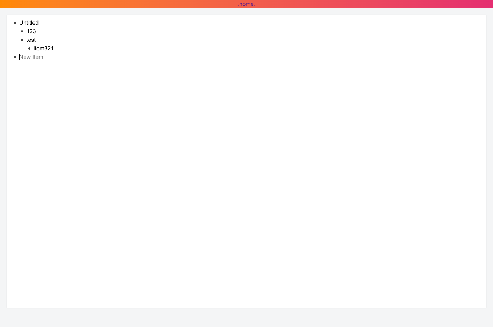

# LosList
a mubu/workflowy demo.

## What is LosList?

This is a demo project that mock workflowy.com & mubu.com.

## How can I run it?

* `git clone https://github.com/LosEcher/LosList.git`
* `yarn` or `npm install`
* `yarn serve` or `npm start`

## ScreenShots

1. init state emptyLIst

2. click **add new**  
3. goto the detail-page 
4. use `tab` to make a sub item.
5. use `enter` to add a empty item.

6. click `.home.` on the top to navigate to the home page.

7. hover on the item, the `delete` btn will show. click to delete.
